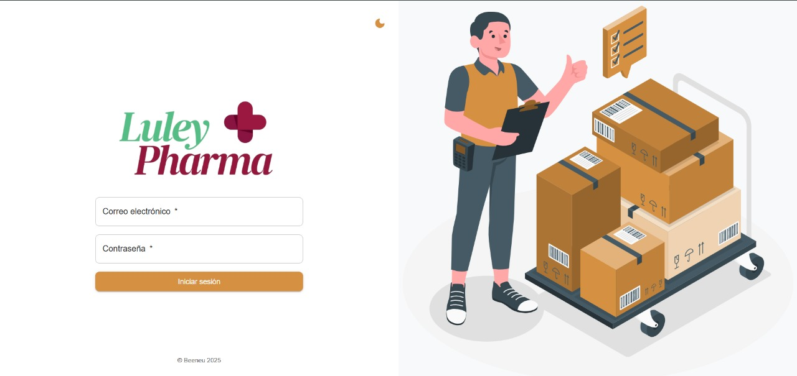
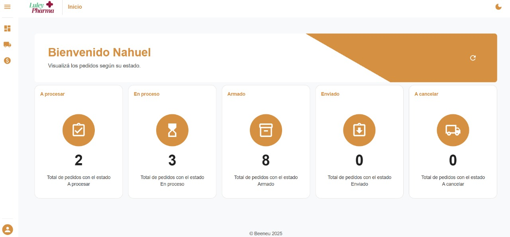
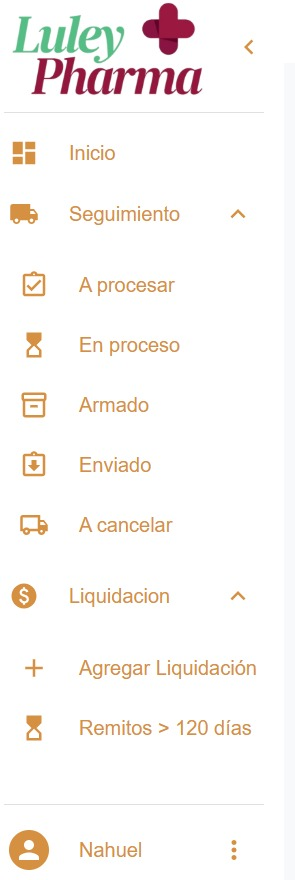
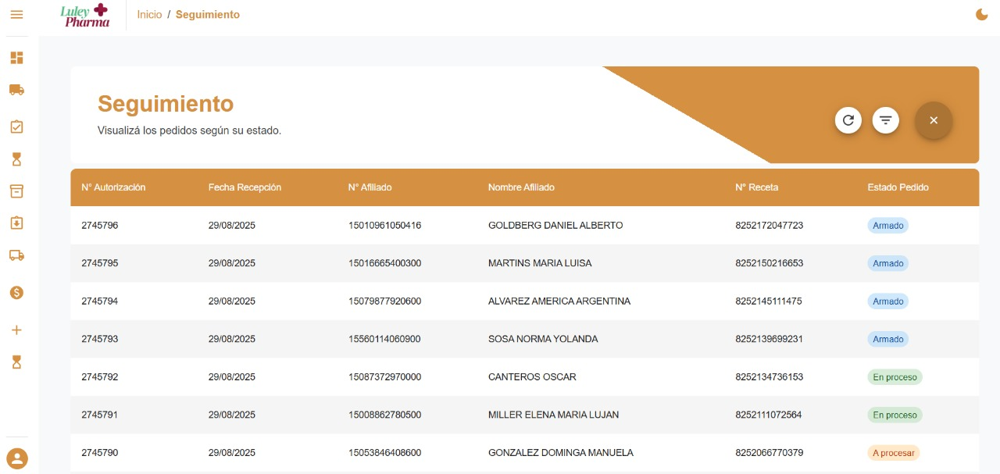
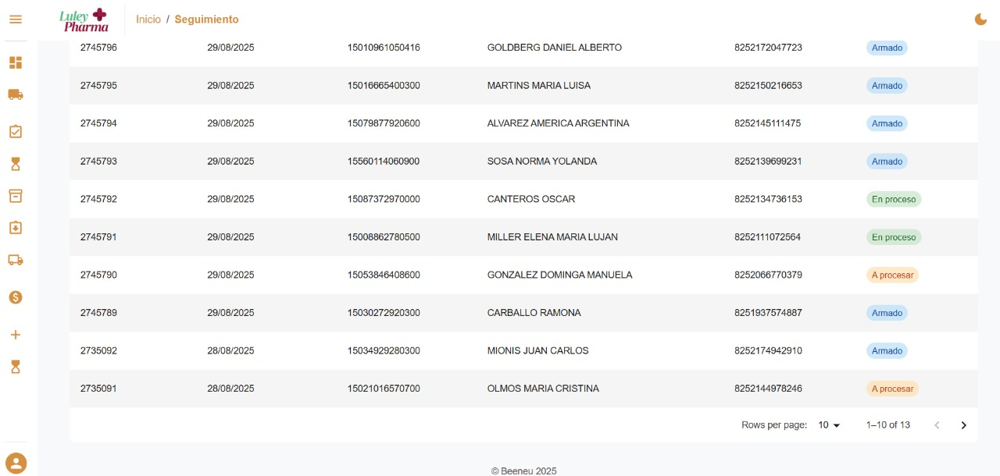
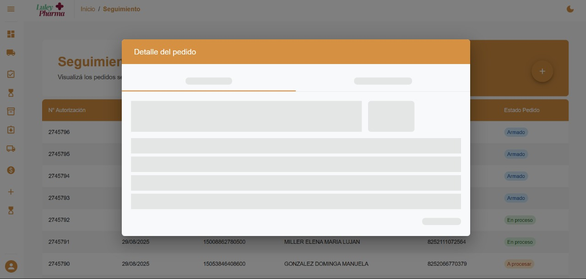
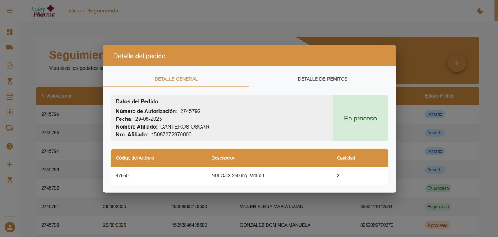
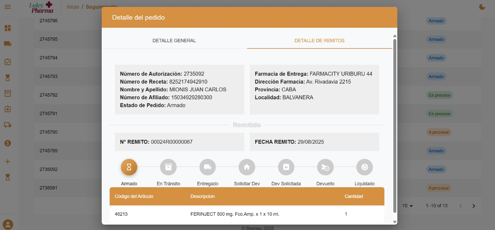
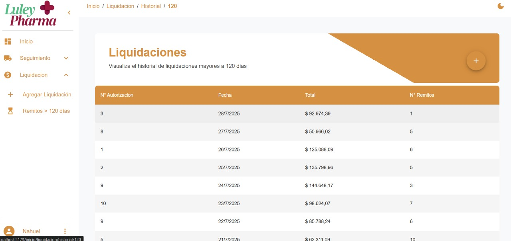
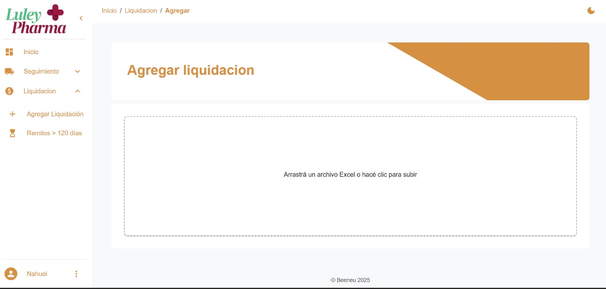

# pharma-dashboard-showcase

Pharmaceutical Order Tracking System

La aplicación permite visualizar en tiempo real los pedidos gestionados entre una obra social y tres droguerías.  
El sistema está dividido en roles de usuario, cada uno con acceso a la información relevante a su función.

---

## Mi rol
- Desarrollo Frontend con **React + RTK Query**.  
- Integración con **SAP HANA** para la obtención de datos.  
- Diseño de componentes UI accesibles utilizando **MUI** como librería principal.  

---

## Tecnologías utilizadas
- React  
- TypeScript  
- Redux Toolkit (RTK Query)  
- PostgreSQL  
- Firebase (autenticación)  
- Playwright (testing end-to-end)  
- Material UI  

---

## Logros clave
- Implementación de **seguimiento en tiempo real** de órdenes.  
- Refactor a **arquitectura modular** para mejorar mantenibilidad.  
- Automatización de **pruebas end-to-end** con Playwright.  

---

## Estructura del repositorio
├── README.md
├── docs/
│ ├── overview.md
│ ├── architecture.png
│ └── features.md
├── demo/
│ ├── screenshots/
│ │    ├── login.jpg
│ │    ├── dashboard.jpg
│ │    ├── dragAndDrop.jpg
│ │    ├── liquidacionesDetail.jpg
│ │    ├── orderDetail.jpg
│ │    ├── orderTracker.jpg
│ │    ├── skeletonOrderTracker.jpg
│ │    ├── tracking.jpg
│ │    ├── tracking2.jpg
│ │    ├── profileDrawer.jpg
│ └── sample-code/
│ └── demo-snippet.tsx

## Documentación
- [Visión general](docs/overview.md)  
- [Características principales](docs/features.md)  
- Arquitectura: ver `docs/architecture.png`  

## Demo visual
Capturas de ejemplo del flujo:  

  
  
  
  
  
  
  
  
  
  